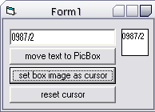



## Set a PictureBox \(including text\) as the cursor

### Description

This example allows you to set the contents of a picturebox as the Mouse Icon (cursor). It uses the ImageList's ExtractIcon method to extract an icon, then it is simply set to the main form's MouseIcon property. Very easy to understand, all lines are commented.
 
### More Info
 

             |
---                |---
**Submitted On**   |2002-06-05 17:28:34
**By**             |[kaze](https://github.com/Planet-Source-Code/PSCIndex/blob/master/ByAuthor/kaze.md)
**Level**          |Beginner
**User Rating**    |4.9 (34 globes from 7 users)
**Compatibility**  |VB 5\.0, VB 6\.0
**Category**       |[Miscellaneous](https://github.com/Planet-Source-Code/PSCIndex/blob/master/ByCategory/miscellaneous__1-1.md)
**World**          |[Visual Basic](https://github.com/Planet-Source-Code/PSCIndex/blob/master/ByWorld/visual-basic.md)
**Archive File**   |[Set\_a\_Pict90745652002\.zip](https://github.com/Planet-Source-Code/kaze-set-a-picturebox-including-text-as-the-cursor__1-35510/archive/master.zip)

